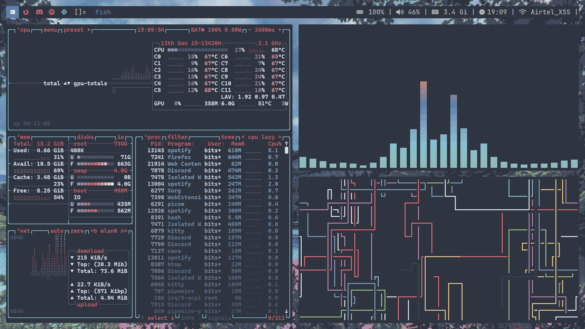
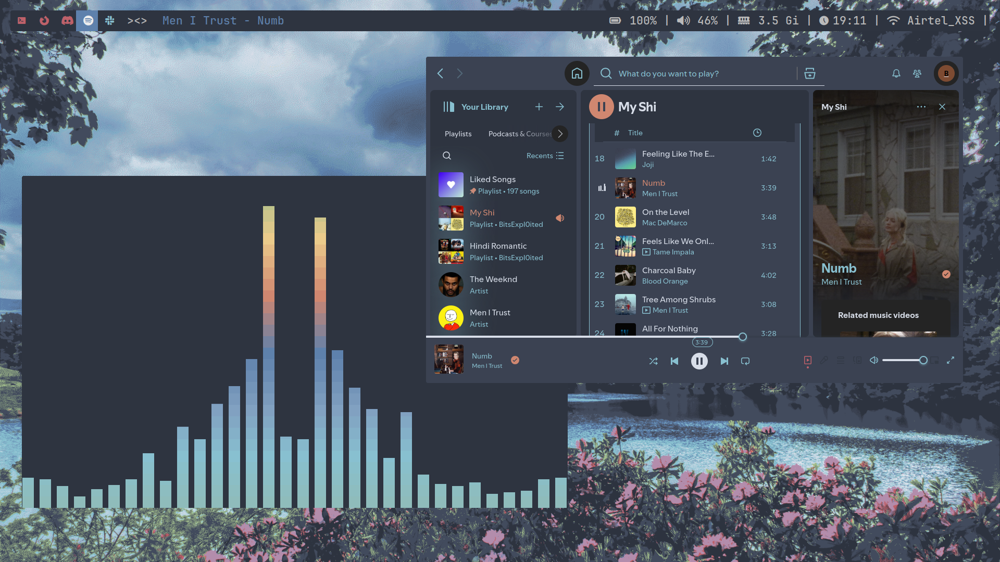
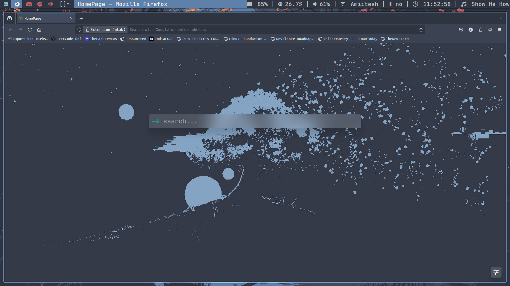
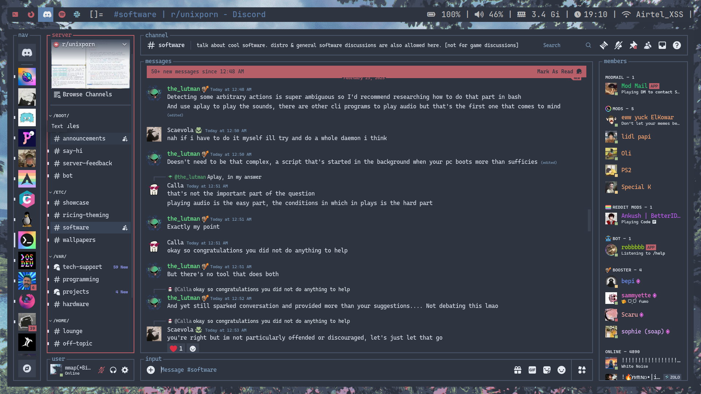

# DWM Dots
## How to apply the configuration

Clone the repository with:
```bash
git clone https://github.com/BitsExploited/dwm-dots
```
and run these commands:
```bash
cd dwm-dots/dwm
sudo make clean install
cd ../slstatus
sudo make clean install
```

## Applications
- Window Manager: [DWM](https://dwm.suckless.org/)
- Statusbar:      [slstatus](https://tools.suckless.org/slstatus/)
- Patches: barpadding, bar height, tag colorscheme, statuscolors, fullgaps






