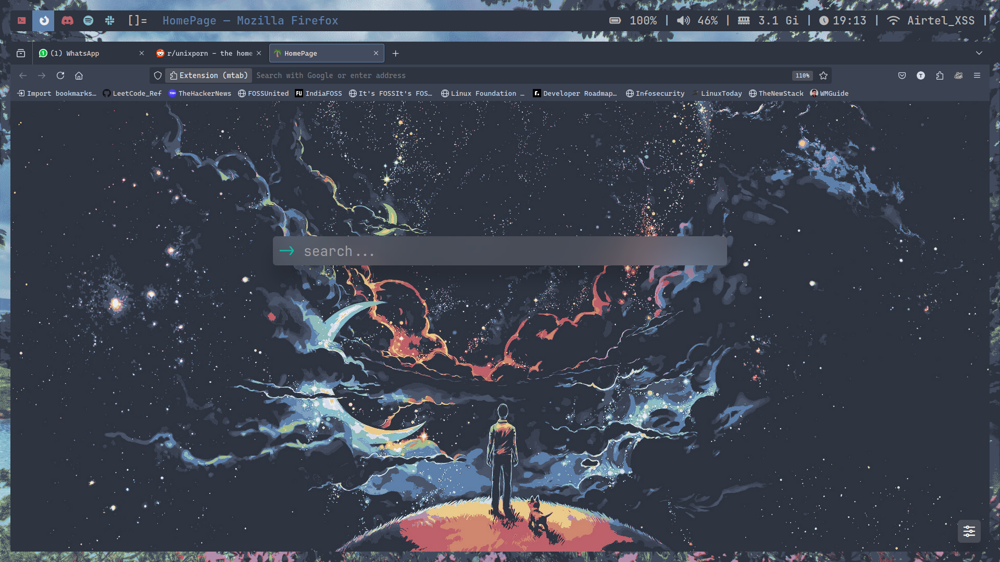

# DWM Dots

## Applications
- Window Manager: [DWM](https://dwm.suckless.org/)
- Statusbar:      [slstatus](https://tools.suckless.org/slstatus/)
- Patches: barpadding, bar height, tag colorscheme, statuscolors, fullgaps

